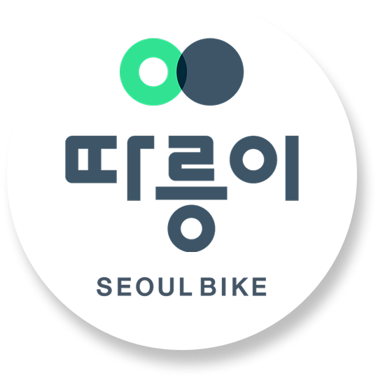

<!-- 로고 이미지 -->

  

<!-- 프로젝트 기본 정보 -->
<h3 align="center">
  서울시 공공자전거 ‘따릉이’ 웹사이트를 분석하여  
  메인 화면 구조를 개선하고 사용자 경험(UX) 중심의 서비스 페이지를 구현한 프로젝트입니다.
</h3>

<h4 align="center">
  [ Front-End Team Project | Team of 5 | Jun 16 – Jun 27, 2025 ]
</h4>
 

<!-- 링크 버튼 -->

  
  

<!-- 내용 -->
## 📌 Project Overview
서울시 공공자전거 ‘따릉이’ 웹사이트를 분석하여  
기존 메인 페이지의 정보 구조와 사용자 흐름을 개선하고  
사용자가 대여소 위치, 대여 방법, 요금 정보 등의 정보를 쉽게 확인할 수 있도록  
**UX 중심의 메인 화면을 재구성**한 프로젝트입니다.
 

#### 🛠 Tech Stack
- **Frontend** : `HTML` · `CSS` · `JavaScript` · `jQuery`
- **Library** : `bxSlider` · `Kakao Maps API`
- **Design** : `Figma` · `Adobe Photoshop` 

#### 🎯 Key Objectives
          
 

## 👤 My Role & Contributions
프로젝트 기획서 작성부터 UI 설계, 메인 지도 기능 구현, 최종 발표까지 프로젝트 전 과정에 참여했습니다.

#### 1. 기획 및 UI/UX 시안 설계
- **Figma 활용**
  
  프로젝트 전체 기획서 작성 및 디자인 시안을 설계하여 팀원들과 시각적 가이드라인 공유.
- **사용자 중심 개편**

  기존 사이트를 분석하여 사용자가 가장 필요로 하는 '대여소 찾기' 기능을 메인 전면에 배치하도록 구조 개선.

#### 2. 지도 기능 구현 (Kakao Maps API)
- **핵심 기능 개발**

  `Kakao Maps API`를 연동하여 메인 화면의 대여소 지도 섹션 구현.
- **커스텀 마커 시각화**

  지도 위에 대여소 위치를 직관적인 원형 마커로 표시하여 정보 가독성 증대.

#### 3. 그래픽 자산 제작 및 적용
- **동적 UI**

  `bxSlider`를 활용한 이미지 슬라이더 및 앱 설치 유도 호버 배너 구현.
- **일관된 아이덴티티**

  하단 배너, 앱 설치 유도 팝업 등 서비스에 필요한 그래픽 요소를 직접 제작하여 전체적인 비주얼 완성도 향상.

#### 4. 프로젝트 최종 발표
- 프로젝트 전략, 설계 의도 및 최종 결과물을 정리하여 팀 대표로 발표 진행.

## 🖥️ Project Preview
| 메인 페이지 (지도 & 슬라이더) | 인터렉션 및 배너 |
| :---: | :---: |
|  |  |
| **서브 : 로그인/회원가입** | **서브 : 서비스 안내 및 공지사항** |
|  |  |

## 🚀 Problem Solving

#### 🔍 API 연동 과정에서의 시각적 구현 
- **상황**: `Kakao Maps API`의 기본 핀 마커가 서비스 디자인 톤과 맞지 않는 문제가 있었습니다.
- **해결**: 기본 마커 대신 `HTML(DOM)`기반 커스텀 마커를 생성하여 브랜드 컬러를 적용한 원형 마커를 구현했습니다.

#### 🤝 협업을 위한 코드 및 파일 관리
- **상황**: 팀 프로젝트 진행 중 파일명과 코드 스타일이 혼재될 가능성이 있었습니다.
- **해결**: 작업 시작 전 파일명 Naming Convention을 정의하고 팀원들과 공유하여 일관된 코드 관리와 협업 환경을 유지했습니다.

## 🌱 Retrospective & Growth

#### ✔ 데이터 기반 UI 설계 경험
사용자가 가장 먼저 수행하는 핵심 행동인 대여소 위치 확인에 집중하여 메인 페이지를 지도 중심 구조로 재설계했습니다.  
이 과정을 통해 사용자의 핵심 과업을 빠르게 해결하는 UI 설계의 중요성을 경험했습니다.

#### ✔ API 커스터마이징 경험
Kakao Maps API의 기본 마커 대신 DOM 기반 커스텀 마커를 구현하며  
라이브러리의 기본 기능에 의존하지 않고 프로젝트 요구사항에 맞게 UI를 확장하는 방법을 배웠습니다.

#### ✔ 디자인과 개발을 연결하는 경험
Figma 시안을 직접 제작하고 구현하면서 Color System, Spacing 등 디자인 가이드의 필요성을 체감했습니다.  
이 경험을 통해 이후 프로젝트에서는 디자인 시스템을 기반으로 한 구조적인 UI 개발을 목표로 하고 있습니다.

#### ✔ 앞으로의 발전 방향
향후에는 공공데이터 실시간 API(대여 가능 수량 등)를 연동하여  
데이터 변화에 따라 UI가 즉각 반응하는 동적 인터페이스 구현에 도전하고 싶습니다.

## ✉️ Contact
- **Email**: your-email@example.com
- **GitHub**: [github.com/y-yjee](https://github.com/y-yjee)

