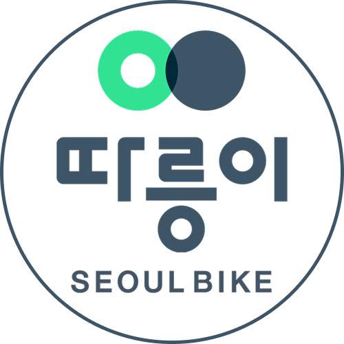
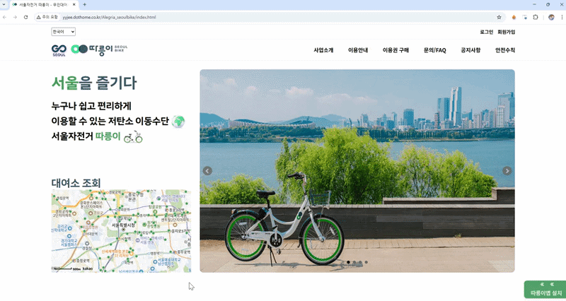
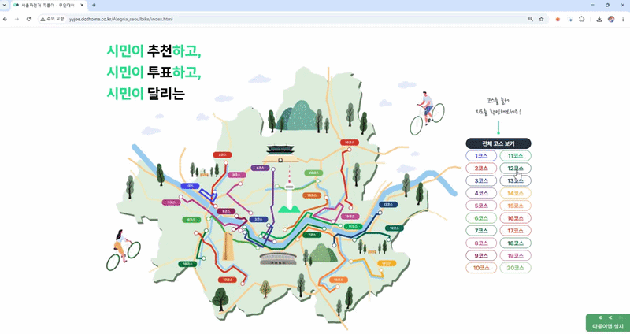
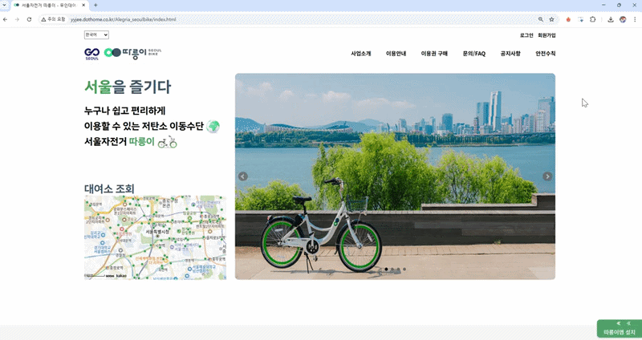
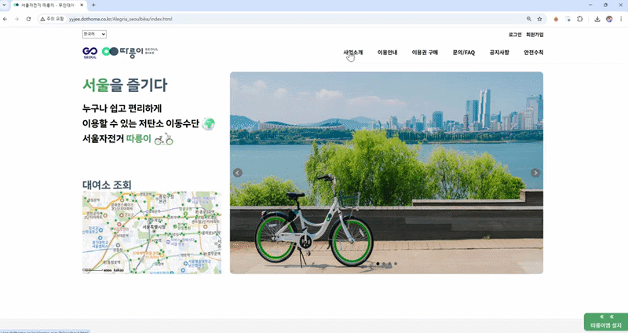

<!-- 로고 이미지 -->

  

# 🚲 서울시 공공자전거 ‘따릉이’

> 서울시 공공자전거 **따릉이 웹사이트를 분석하여 메인 화면 구조를 개선하고 사용자 중심 서비스 페이지를 구현한 프로젝트**

🔗 <a href="https://y-yjee.github.io/projects/seoul-bike/" target="_blank">Live Demo</a>  |  
📄 <a href="FIGMA_OR_PDF_LINK" target="_blank">기획서 보기 (Figma)</a>

---

## 📌 프로젝트 개요

| 항목 | 내용 |
|-----|-----|
프로젝트 기간 | 2025.06.16 ~ 2025.06.27 |
프로젝트 형태 | 팀 프로젝트 (5명) |
프로젝트 목표 | 기존 따릉이 사이트 UX 분석 후 메인 구조 개선 |

---

## 🛠 사용 기술

---

## 🔍 프로젝트 배경

기존 따릉이 웹사이트를 분석한 결과 다음과 같은 문제점을 발견했습니다.

- 메인 화면에서 **대여소 정보를 직관적으로 확인하기 어려움**
- 서비스 정보가 분산되어 있어 **사용자가 원하는 정보를 찾기 어려움**
- 공공 서비스 특성상 **정보 전달 중심의 UI 구조 필요**

따라서 사용자가 가장 많이 찾는 기능인  
**대여소 위치 확인 기능을 중심으로 메인 화면을 재구성**했습니다.

---

## 💡 개선 방향

- **지도 중심 인터페이스 구성**
- 대여 / 반납 / 요금 정보를 **탭 메뉴 구조로 정리**
- 서비스 안내 콘텐츠 **가독성 중심으로 재배치**
- 공공 서비스 특성에 맞춘 **접근성 중심 UI**

---

## 👩‍💻 담당 역할

**기획 및 UI 설계**

- 프로젝트 전체 **기획서 작성**
- **Figma 기반 UI 시안 제작**
- 서비스 흐름 및 메인 구조 설계

**지도 기능 구현**

- **Kakao Maps API 연동**
- 대여소 위치 **지도 마커 표시 기능 구현**

**디자인 자산 제작**

- 서비스 안내 **배너 디자인 제작**
- **앱 설치 유도 인터랙션 배너 구현**

**프로젝트 발표**

- 프로젝트 전략 및 결과 발표 진행

---

## 🎥 주요 기능

### 메인 페이지 – 대여소 지도

- Kakao Map API 기반 지도 구현  
- 대여소 위치 **마커 표시 기능**

---

### 메인 페이지 – 서비스 안내 인터랙션

- 코스 버튼 클릭 시 **이미지 전환**
- bxSlider 기반 **메인 이미지 슬라이더**
- 하단 서비스 안내 배너

---

### 서비스 페이지

GNB 메뉴 기반 서비스 페이지 구현

- 로그인 / 회원가입
- 사업소개
- 이용안내
- 이용권 구매
- 문의 / FAQ
- 공지사항
- 안전수칙

---

## 🔧 트러블슈팅

### API 연동 과정에서의 문제

지도 API 연동 과정에서  
좌표 데이터 처리 및 마커 생성 과정에서 오류가 발생했습니다.

이를 해결하기 위해

- API 문서 재확인
- 데이터 처리 로직 수정
- 지도 마커 생성 방식 개선

을 통해 정상적으로 대여소 위치가 표시되도록 구현했습니다.

---

## 📚 프로젝트를 통해 얻은 경험

- 공공 데이터 API 활용 경험
- 지도 API 기반 서비스 구현 경험
- 실제 서비스 UX 분석 및 개선 경험
- 협업 프로젝트 경험

---

## ✨ 마무리

이 프로젝트는 단순히 기존 사이트를 클론하는 것이 아니라  
**사용자가 왜 이 서비스를 사용하는가**라는 질문에서 시작했습니다.

기존 사이트의 정보 구조를 분석하고  
**지도 중심 인터페이스와 직관적인 정보 구조**로 재구성하여  
사용자가 필요한 정보를 빠르게 찾을 수 있도록 개선했습니다.
